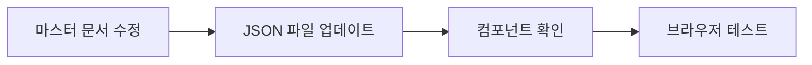

# 공통 요소

> 모든 페이지에서 공유되는 요소들을 정의합니다.

---

## 브랜드

### 기본 정보

| 항목 | 값 |
|------|-----|
| 제품명 | Roomfit (룸핏) |
| 태그라인 | 스마트 웨이트 머신 |
| 회사명 | 주식회사 위스피온 (WESPION) |

### 컬러 시스템

| 용도 | 색상 | HEX | 사용 |
|------|------|-----|------|
| Primary | 파랑 | `#5252FF` | 주요 CTA, 강조 |
| Secondary | 라임 | `#BAFC27` | 보조 강조, 하이라이트 |
| Background (Light) | 흰색 | `#FFFFFF` | 라이트 모드 배경 |
| Background (Dark) | 딥블랙 | `#0a0a0f` | 다크 모드 배경 |
| Text (Light) | | `#1a1a1a` | 라이트 모드 텍스트 |
| Text (Dark) | | `#FFFFFF` | 다크 모드 텍스트 |

### 타이포그래피

| 용도 | 폰트 | 굵기 | 크기 |
|------|------|------|------|
| 한글 본문 | Pretendard | 400-700 | 16-18px |
| 영문/숫자 | Space Grotesk | 500-700 | - |
| 제목 | Pretendard | 700-800 | 32-72px |

---

## 네비게이션 (Navbar)

### 기획

| 항목 | 내용 |
|------|------|
| **목적** | 사이트 탐색 및 주요 행동 유도 |
| **전환 목표** | 페이지 내 이동, 구매 버튼 클릭 |

### 콘텐츠

#### 메인 링크

| 순서 | 라벨 | href | 페이지 |
|------|------|------|--------|
| 1 | 제품 스펙 | `#specs` | 메인 |
| 2 | 무게 모드 | `#modes` | 메인 |
| 3 | 스마트 앱 | `#app` | 메인 |

#### 페이지 링크

| 라벨 | href | 설명 |
|------|------|------|
| 앱 자세히 보기 | `/app` | 앱 랜딩 페이지 |
| 트레이너/센터 | `/business` | B2B 랜딩 페이지 |

#### CTA 버튼

| 텍스트 | 동작 |
|--------|------|
| 구매하기 | 구매 페이지/모달 |

### 구현

| 항목 | 값 |
|------|-----|
| **컴포넌트** | `src/components/Navbar.tsx` |
| **JSON 키** | `[page]-content.json → nav` |

---

## 푸터 (Footer)

### 기획

| 항목 | 내용 |
|------|------|
| **목적** | 법적 정보 제공, 신뢰 구축, 추가 탐색 |
| **전환 목표** | 소셜 팔로우, 고객센터 연결 |

### 콘텐츠

#### 회사 정보

| 항목 | 값 |
|------|-----|
| 회사명 | 주식회사 위스피온 |
| 대표 | 황성우 |
| 주소 | 서울시 성동구 뚝섬로1길 31, 서울숲M타워 505호 |
| 사업자등록번호 | 812-88-02637 |
| 통신판매업신고 | 2024-서울성동-0293 |

#### 링크

| 라벨 | href |
|------|------|
| 이용약관 | `/terms` |
| 개인정보처리방침 | `/privacy` |
| 고객센터 | `/support` |

#### 소셜

| 플랫폼 | URL |
|--------|-----|
| Instagram | `https://www.instagram.com/roomfit.official/` |

#### 저작권

```
© 2025 WESPION. All rights reserved.
```

### 구현

| 항목 | 값 |
|------|-----|
| **컴포넌트** | `src/components/Footer.tsx` |
| **JSON 키** | `[page]-content.json → footer` |

---

## 이미지 공통 규칙

### 디렉토리 구조

```
public/
├── images/
│   ├── main/          # 메인 페이지 이미지
│   ├── app/           # 앱 페이지 이미지
│   ├── business/      # B2B 페이지 이미지
│   └── shared/        # 공통 이미지 (로고 등)
├── gifs/              # GIF 애니메이션
└── videos/            # 비디오 파일
```

### 파일 네이밍 규칙

```
[섹션]-[용도]-[번호?].[확장자]
예: hero-background.webp, specs-weight-01.png
```

### 권장 포맷

| 용도 | 포맷 | 이유 |
|------|------|------|
| 사진 | WebP | 압축률, 품질 |
| 아이콘 | SVG | 스케일러블 |
| 애니메이션 | GIF/WebP | 호환성 |
| 영상 | MP4/WebM | 브라우저 지원 |

---

## 동기화 워크플로우

### 마스터 문서 → JSON



### 체크리스트

수정 시 반드시 확인:

1. [ ] 마스터 문서 해당 섹션 업데이트
2. [ ] JSON 파일 동기화
3. [ ] 이미지 파일 경로 확인
4. [ ] 개발 서버에서 확인
5. [ ] 반응형 테스트 (모바일/태블릿/데스크톱)
